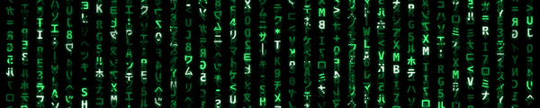

# <a href="https://www.linkedin.com/in/kent28808/">Ken's</a> IT, Cybersecurity & Software Engineering Portfolio

  

  
  

I'm a technology professional with experience spanning software engineering, IT operations, cloud infrastructure, and cybersecurity.   
My background includes developing software applications, supporting enterprise systems, working with Linux and Windows environments, and building hands-on labs to strengthen my skills in networking and security.

---
## 🚀 Project Showcase

### ⚔️ Threat Hunting and Security Operations

🔸 **[Azure Cloud Windows Honeypot with End-to-End Detection & Incident Response](https://github.com/kent28808/sentineltrap-cloud-honeypot/tree/main)**   
&nbsp;&nbsp;&nbsp;&nbsp;&nbsp;*Deployed an exposed Azure honeypot and used Microsoft Defender and Sentinel to detect, investigate, and respond to attacks.*  
🔸 **[Threat Hunting Scenario (Credential Compromise Investigation)](https://github.com/kent28808/nimbus-health-credential-compromise-threat-hunt)**  
&nbsp;&nbsp;&nbsp;&nbsp;&nbsp;*KQL threat hunt tracing a compromised account from initial access to potential data exfiltration.*

### 🛡️ Vulnerability Management 

🔹 **[Enterprise Vulnerability Management Program](https://github.com/kent28808/Vulnerability-Management-Program)**   
&nbsp;&nbsp;&nbsp;&nbsp;&nbsp;*End-to-end program for vulnerability discovery, prioritization, remediation, and validation.*  
🔹 **[Windows 11 DISA STIG Remediation (PowerShell & Tenable)](https://github.com/kent28808/windows-11-disa-stig-remediations)**  
&nbsp;&nbsp;&nbsp;&nbsp;&nbsp;*Remediated Windows 11 DISA STIG hardening with PowerShell and validated using Tenable.*

### </> Software Engineering

💠 **[Olive Branch](https://www.joincolab.io/product/olive-branch)**-*Olive Branch is a communication tool that makes it easier for loved ones to reach out to each other after conflict.*  
💠 **[Wheretogo](https://github.com/kent28808/Wheretogo)**-*Travel application that uses the Yelp api to search for popular restaurants based on location.*  
💠 **[Samurai Champloo Game](https://github.com/kent28808/Clicky-Game)**-*Users can test their memory by not clicking on the same character more than once.*  

### 🤳 Connect With Me

  &nbsp;
 

  

